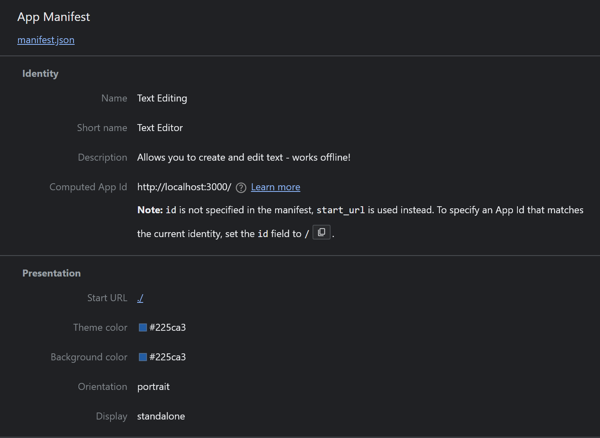
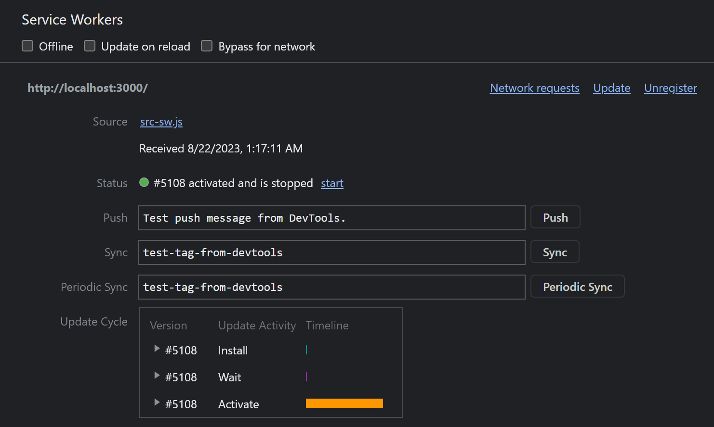
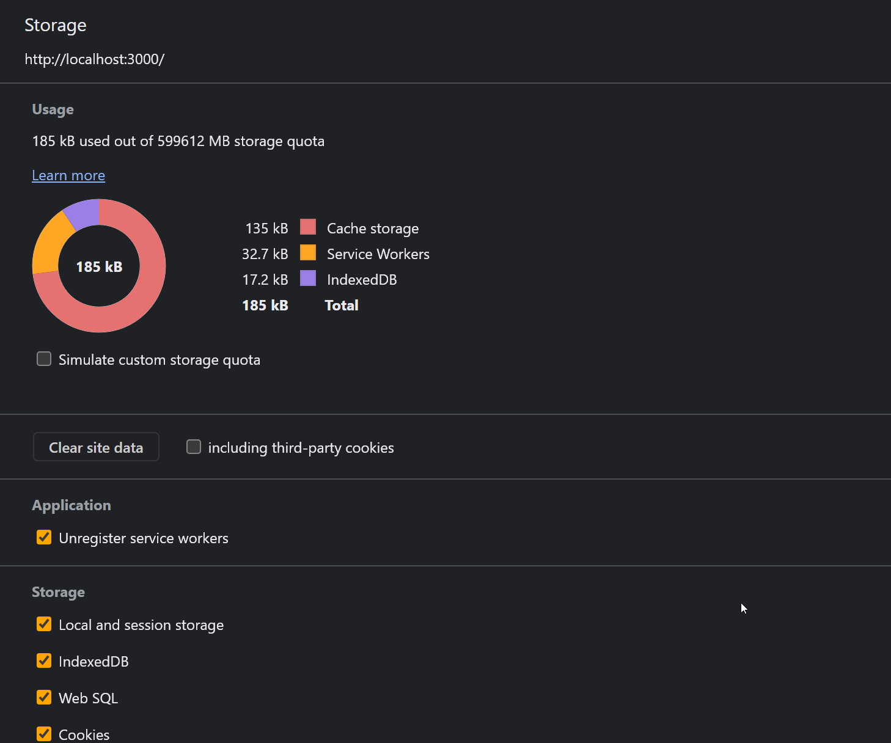

# Text Editor

[Description](#description) || [Installation](#installation) || [Example](#example) 

## Description

This is an offline application that allows you to create/edit text while being able to download the webpage afterwards for future use.

## Installation

The user is expected to download the application by clicking `Install` and afterwards running `npm i` in their terminal to install dependencies

## Example 

You may view a video example [here](https://www.youtube.com/watch?v=SX9zWKv1pns&ab_channel=Nato)

Example of how your Manifest should look

 

Example of how your Service Workers should look

Example of how your Storage should look

